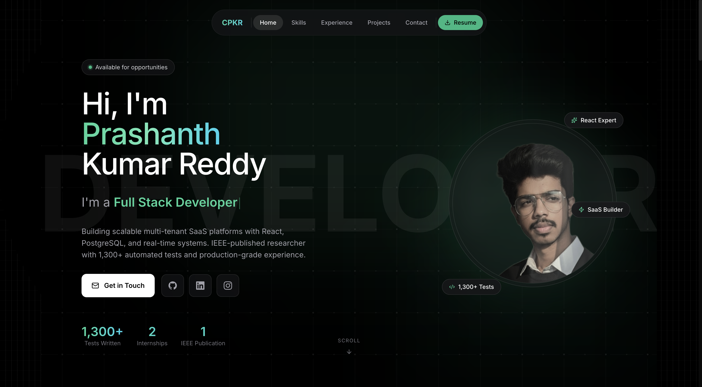

# 🚀 Prashanth Kumar Reddy - Portfolio

A modern, animated personal portfolio website built with React and Vite, featuring smooth scroll animations, interactive UI components, and a futuristic design.

[](https://prashanth-k-r.vercel.app/)
[](https://github.com/prashanth-k-1/Portfolio)



## ✨ Features

- **🎨 Modern UI/UX** - Clean, futuristic design with emerald accent theme
- **�� Smooth Animations** - Scroll-triggered animations using Framer Motion
- **📱 Fully Responsive** - Optimized for all screen sizes
- **⚡ High Performance** - Built with Vite for lightning-fast load times
- **🎭 Interactive Elements** - Hover effects, marquee scrolling, and 3D effects
- **🌙 Dark Theme** - Eye-friendly dark mode design

## 🛠️ Tech Stack

| Category | Technologies |
|----------|-------------|
| **Frontend** | React 18, JavaScript |
| **Styling** | Tailwind CSS |
| **Animations** | Framer Motion |
| **Build Tool** | Vite 6 |
| **Icons** | Lucide React, React Icons |
| **Deployment** | Vercel |

## 📂 Project Structure

```
├── public/
│   ├── favicon.svg
│   └── FinalResume.pdf
├── src/
│   ├── assets/
│   │   ├── prashanth.png
│   │   └── projects/
│   ├── components/
│   │   ├── BackToTop.jsx
│   │   ├── Contact.jsx
│   │   ├── Experience.jsx
│   │   ├── Hero.jsx
│   │   ├── Loader.jsx
│   │   ├── Navbar.jsx
│   │   ├── Projects.jsx
│   │   └── Technologies.jsx
│   ├── constants/
│   │   └── index.js
│   ├── App.jsx
│   ├── index.css
│   └── main.jsx
├── index.html
├── package.json
├── tailwind.config.js
└── vite.config.js
```

## 🚀 Getting Started

### Prerequisites

- Node.js 18+ 
- npm or yarn

### Installation

1. **Clone the repository**
   ```bash
   git clone https://github.com/prashanth-k-1/Portfolio.git
   cd Portfolio
   ```

2. **Install dependencies**
   ```bash
   npm install
   ```

3. **Start development server**
   ```bash
   npm run dev
   ```

4. **Open in browser**
   ```
   http://localhost:5173
   ```

### Build for Production

```bash
npm run build
```

## 📄 Sections

### 🏠 Hero
- Animated typewriter effect
- Professional introduction
- Quick navigation links

### 💻 Technologies
- Scrolling marquee of skills
- 19+ technologies with icons
- Interactive hover effects with glow

### 💼 Experience
- Timeline-style layout
- Work experience cards with animations
- Technology tags

### 📚 Publication
- IEEE published research paper
- Model performance metrics
- Direct DOI link

### 🎯 Projects
- Featured projects showcase
- Live demo links
- Technology stack display

### 📬 Contact
- Contact form
- Social media links
- Location information

## 🎨 Color Palette

| Color | Hex | Usage |
|-------|-----|-------|
| Emerald | `#10B981` | Primary accent |
| Black | `#000000` | Background |
| Zinc | `#71717A` | Text secondary |
| White | `#FFFFFF` | Text primary |

## 📱 Responsive Breakpoints

- **Mobile**: < 640px
- **Tablet**: 640px - 1024px
- **Desktop**: > 1024px

## ⚡ Performance

- Lighthouse Score: 90+
- First Contentful Paint: < 1.5s
- Code splitting enabled
- Optimized images

## 📝 License

This project is open source and available under the [MIT License](LICENSE).

## 🤝 Connect

- **Portfolio**: [prashanth-k-r.vercel.app](https://prashanth-k-r.vercel.app/)
- **LinkedIn**: [linkedin.com/in/cprashanthkr](https://linkedin.com/in/cprashanthkr)
- **GitHub**: [github.com/prashanth-k-1](https://github.com/prashanth-k-1)
- **Email**: prashanthkr7799@gmail.com

---

<p align="center">
  Made with ❤️ by Prashanth Kumar Reddy
</p>
